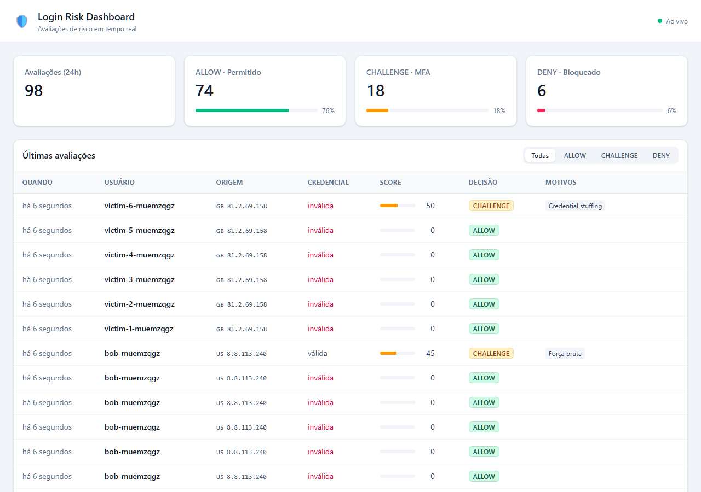
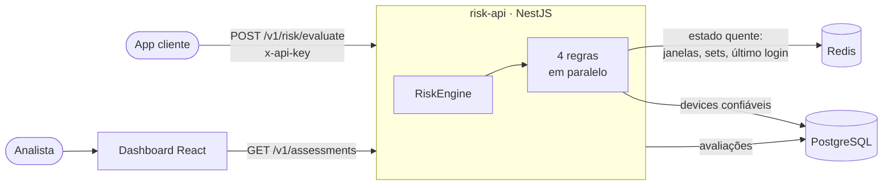

# Login Risk Service

[](https://github.com/EduardoBolize/login-risk-service/actions/workflows/ci.yml)

Serviço que avalia **em tempo real o risco de uma tentativa de login** e responde com um score (0–100), uma decisão (`ALLOW` / `CHALLENGE` / `DENY`) e os motivos — para que a aplicação cliente decida entre liberar, pedir MFA ou bloquear.

```http
POST /v1/risk/evaluate
x-api-key: dev-api-key

{ "userId": "user-123", "ip": "177.71.0.10", "deviceId": "abc", "success": true }
```

```json
{
  "assessmentId": "4f7c…",
  "score": 80,
  "decision": "DENY",
  "reasons": ["NEW_DEVICE", "IMPOSSIBLE_TRAVEL"],
  "degraded": false,
  "evaluatedAt": "2026-09-23T12:00:00.000Z"
}
```



## Arquitetura



O caminho quente, a avaliação das regras, depende só do Redis, com timeout de 200 ms por comando. O Postgres guarda o histórico de avaliações e os devices confiáveis. Na AWS, tudo roda em ECS Fargate, RDS e ElastiCache ([detalhes](docs/deploy.md)).

## Stack

| Camada | Tecnologia |
|---|---|
| API | NestJS (Node.js 22) + Prisma |
| Dados | PostgreSQL (histórico, devices) · Redis (estado quente das regras) |
| Dashboard | React + Vite |
| Infra | AWS (ECS Fargate, RDS, ElastiCache, S3) via Terraform |
| CI/CD | GitHub Actions |

## Motor de regras

Cada regra implementa `RiskRule` (padrão Strategy) com duas fases:

1. **`evaluate`** — leitura pura do estado acumulado de logins anteriores.
2. **`record`** — incorpora o login atual ao estado, *depois* de todas as regras avaliarem.

| Regra | Detecta | Técnica | Peso |
|---|---|---|---|
| `BruteForceRule` | ≥ 5 falhas na mesma conta em 15 min | Redis sorted set (janela deslizante) | 45 |
| `CredentialStuffingRule` | > 5 contas distintas a partir do mesmo IP | Redis set com TTL | 50 |
| `NewDeviceRule` | Device nunca usado num login bem-sucedido | Postgres + cache read-through no Redis | 30 |
| `ImpossibleTravelRule` | Deslocamento > 900 km/h desde o último login | Redis hash + GeoIP + Haversine | 50 |

**Score** = soma dos pesos das regras disparadas (máx. 100) → `< 30 ALLOW` · `30–70 CHALLENGE` · `> 70 DENY`.

## Decisões técnicas

**Regras explicáveis em vez de um modelo de ML.** Cada decisão vem com os motivos (`reasons`) e o detalhamento por regra. Isso é auditável, não depende de dados de treino e permite explicar ao usuário por que o MFA foi pedido. Com as avaliações armazenadas, dá para treinar um modelo depois, usando o histórico como base.

**Fail-open quando o Redis falha.** Se uma regra falhar (ex.: timeout de 200 ms), ela é ignorada, o login é avaliado com as demais e a resposta vem com `degraded: true`. Bloquear todos os logins porque o cache caiu seria pior do que perder um sinal temporariamente. O comportamento foi validado derrubando o Redis com a API no ar.

**Avaliar antes de registrar.** Todas as regras avaliam o estado *anterior* ao login atual, e só depois ele é registrado. Isso evita que o próprio evento influencie a decisão, e cada regra pode ser testada isoladamente.

**Janela deslizante para força bruta.** Um sorted set indexado por timestamp conta as falhas dos últimos 15 minutos exatos. Com `INCR` + `EXPIRE`, a janela zeraria em momentos fixos e um atacante poderia distribuir as tentativas entre duas janelas.

**Um device só vira confiável após um login bem-sucedido.** Falhas nunca adicionam devices ao histórico. O primeiro login de um usuário não é penalizado, porque ainda não há histórico para comparar.

**Segredos fora do código e da imagem.** Na AWS, `DATABASE_URL` e `API_KEYS` ficam no Secrets Manager e são injetados pelo ECS no boot. O GitHub Actions autentica por OIDC, com uma role restrita à branch `main`, sem access keys guardadas.

## Qualidade

- **Testes unitários:** 32 na API (Jest, com Redis simulado em memória) e 9 no dashboard (Vitest + Testing Library)
- **Ponta a ponta:** `pnpm simulate` roda na CI contra Postgres e Redis reais
- **CI a cada PR:** lint, typecheck, testes, build, build das imagens Docker e `terraform validate`

## Rodando com Docker

Sobe Postgres, Redis, API (aplicando as migrations no boot) e dashboard:

```bash
docker compose up -d --build --wait
pnpm simulate          # gera dados de exemplo (requer Node + pnpm install)
```

- API: http://localhost:3000 (Swagger em `/docs`)
- Dashboard: http://localhost:8080

## Rodando localmente

Pré-requisitos: Node 22, pnpm (`corepack enable`), Docker.

```bash
pnpm install
pnpm infra:up                                  # Postgres + Redis
cp apps/api/.env.example apps/api/.env
pnpm --filter api prisma migrate dev --name init
pnpm dev:api                                   # http://localhost:3000
```

- Swagger: http://localhost:3000/docs
- Health: http://localhost:3000/health

Dashboard (em outro terminal):

```bash
cp apps/dashboard/.env.example apps/dashboard/.env
pnpm dev:dashboard                             # http://localhost:5173
```

```bash
pnpm test        # testes unitários
pnpm lint
pnpm simulate    # simula ataques contra a API rodando
```

### Simulação de ataques

`pnpm simulate` executa cenários realistas contra a API e confere cada decisão. Ele também roda na CI como teste de ponta a ponta, com Postgres e Redis reais:

```
✔ Usuário legítimo: primeiro login no laptop (Brasil)
    ALLOW     score   0  —
✔ Device novo: Alice entra pelo celular
    CHALLENGE score  30  NEW_DEVICE
✔ Conta comprometida: Lisboa 30 min depois, device desconhecido
    DENY      score  80  NEW_DEVICE, IMPOSSIBLE_TRAVEL
✔ Brute force: 5 senhas erradas e então a correta
    CHALLENGE score  45  BRUTE_FORCE
✔ Credential stuffing: um IP testando 6 contas
    CHALLENGE score  50  CREDENTIAL_STUFFING
```

## Deploy na AWS

A infraestrutura fica em [`infra/terraform`](infra/terraform): VPC em 2 AZs, ECS Fargate atrás de um ALB, RDS PostgreSQL, ElastiCache Redis, S3 para o dashboard e Secrets Manager. O deploy roda via GitHub Actions a cada push na `main`, autenticando na AWS por **OIDC** (sem access keys no GitHub).

Passo a passo, arquitetura e custos em [docs/deploy.md](docs/deploy.md).

## Demo

1. `docker compose up -d --build --wait` e abra o dashboard em http://localhost:8080
2. Rode `pnpm simulate` e veja as avaliações aparecerem em tempo real
3. Filtre por **DENY** e clique na linha da Alice: Brasil → Lisboa em 30 minutos equivale a ~15.000 km/h, somado a um device desconhecido
4. Derrube o Redis com `docker compose stop redis` e chame a API: ela continua respondendo, com `degraded: true`
   ```bash
   curl -X POST localhost:3000/v1/risk/evaluate -H 'x-api-key: dev-api-key' -H 'content-type: application/json' \
     -d '{"userId":"carol","ip":"177.71.0.10","deviceId":"d1","success":true}'
   ```
5. Suba o Redis de novo com `docker compose start redis`

## Endpoints

| Método | Rota | Descrição |
|---|---|---|
| `POST` | `/v1/risk/evaluate` | Avalia uma tentativa de login |
| `GET` | `/v1/assessments?decision=&userId=&limit=` | Últimas avaliações |
| `GET` | `/v1/assessments/summary` | Contagem por decisão nas últimas 24h |
| `GET` | `/health` | Status do Postgres e do Redis |
