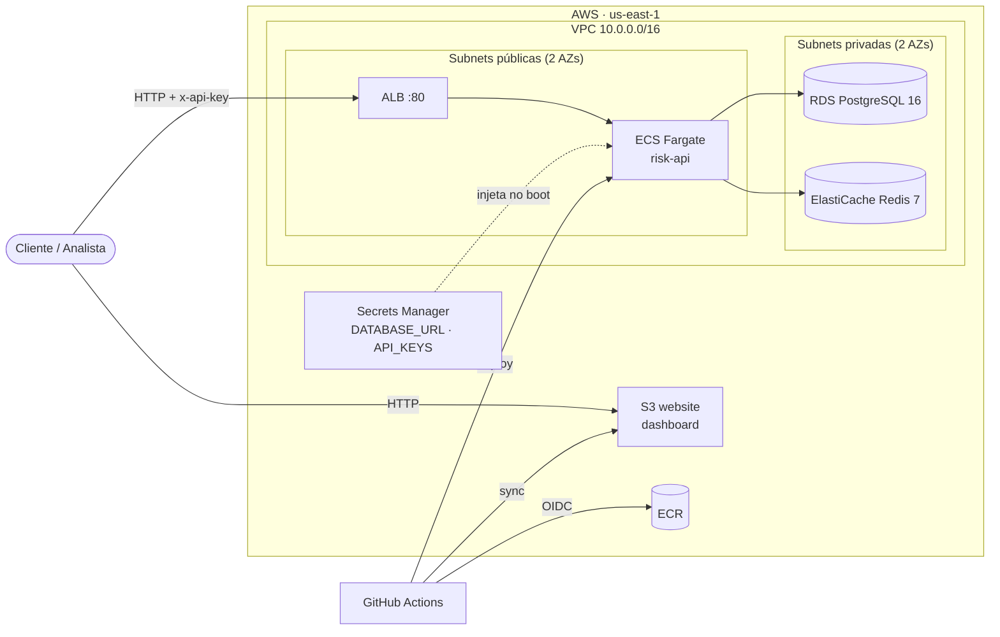

# Deploy na AWS

Runbook para subir o ambiente de demonstração com Terraform e publicar via GitHub Actions.

## Arquitetura



**Decisões para manter o custo baixo:**

- **Sem NAT Gateway** (economiza ~US$ 32/mês). As tasks rodam em subnet pública com IP público para alcançar ECR, CloudWatch e Secrets Manager, mas o security group só aceita tráfego vindo do ALB.
- **Postgres e Redis em subnets privadas**, acessíveis apenas pelo security group da API.
- **Dashboard servido direto pelo S3.** Em produção, o próximo passo seria CloudFront com HTTPS e bucket privado (OAC).
- **Sem HTTPS no ALB**, porque exigiria domínio e certificado ACM.

## Custo estimado

| Recurso | ~US$/mês |
|---|---|
| ALB | 16 |
| RDS `db.t4g.micro` + 20 GB | 14 |
| ElastiCache `cache.t4g.micro` | 12 |
| Fargate (0,25 vCPU / 0,5 GB) | 9 |
| IPs públicos IPv4 (3) | 11 |
| Secrets Manager, ECR, S3, CloudWatch | ~1 |
| **Total** | **~63/mês ≈ US$ 2/dia** |

> ⚠️ Suba para a demo e rode `terraform destroy` depois. Contas novas podem ter parte disso coberta pelo free tier.

## Pré-requisitos

- Conta AWS com um usuário ou SSO com permissão de administrador
- [AWS CLI v2](https://aws.amazon.com/cli/) configurado (`aws configure` ou `aws sso login`)
- [Terraform ≥ 1.10](https://developer.hashicorp.com/terraform/install)
- `gh` autenticado no repositório

```bash
winget install Amazon.AWSCLI Hashicorp.Terraform
aws configure                     # access key do SEU usuário IAM — nunca commitar
aws sts get-caller-identity       # confere a conta
```

## 1. Bucket do state (uma vez só)

```bash
cd infra/terraform/bootstrap
terraform init
terraform apply                   # anota o output state_bucket
```

## 2. Infraestrutura

```bash
cd infra/terraform
cp backend.hcl.example backend.hcl    # preencha o bucket com o output acima
terraform init -backend-config=backend.hcl
terraform plan
terraform apply                       # ~10–15 min (o RDS é o mais lento)
```

## 3. Conectar o GitHub Actions

Copia os outputs do Terraform para as variáveis do repositório. Nenhum desses valores é secreto: a API key continua no Secrets Manager e só é lida no momento do deploy.

```bash
./scripts/sync-github-vars.sh
```

## 4. Primeiro deploy

Assim que as variáveis existem, todo push na `main` dispara o workflow `Deploy`. Para o primeiro deploy, rode manualmente:

```bash
gh workflow run deploy.yml
gh run watch
```

O workflow:

1. assume a role via **OIDC**, sem access keys guardadas no GitHub;
2. faz o build da imagem da API, envia ao ECR com a tag do commit, registra uma nova revisão da task definition e atualiza o serviço ECS, esperando a estabilização;
3. faz um smoke test em `/health`;
4. lê a API key do Secrets Manager, faz o build do dashboard e sincroniza com o S3.

> No primeiro `apply`, o serviço ECS é criado antes de existir imagem no ECR, então as tasks falham até esse primeiro deploy. É esperado.

## 5. Testar

```bash
cd infra/terraform
API_URL=$(terraform output -raw api_url)
API_KEY=$(aws secretsmanager get-secret-value --secret-id login-risk/api-keys --query SecretString --output text)

curl "$API_URL/health"
API_URL=$API_URL API_KEY=$API_KEY pnpm simulate
terraform output dashboard_url        # abre no navegador
```

Logs da API: CloudWatch → Log groups → `/ecs/login-risk-api`.

## 6. Destruir

```bash
cd infra/terraform
terraform destroy

# Evita que o próximo push na main tente fazer deploy numa infra que não existe mais
gh variable delete AWS_ROLE_ARN
```

O bucket de state (bootstrap) custa centavos e pode ficar. Para removê-lo, esvazie-o e rode `terraform destroy` em `infra/terraform/bootstrap`.
